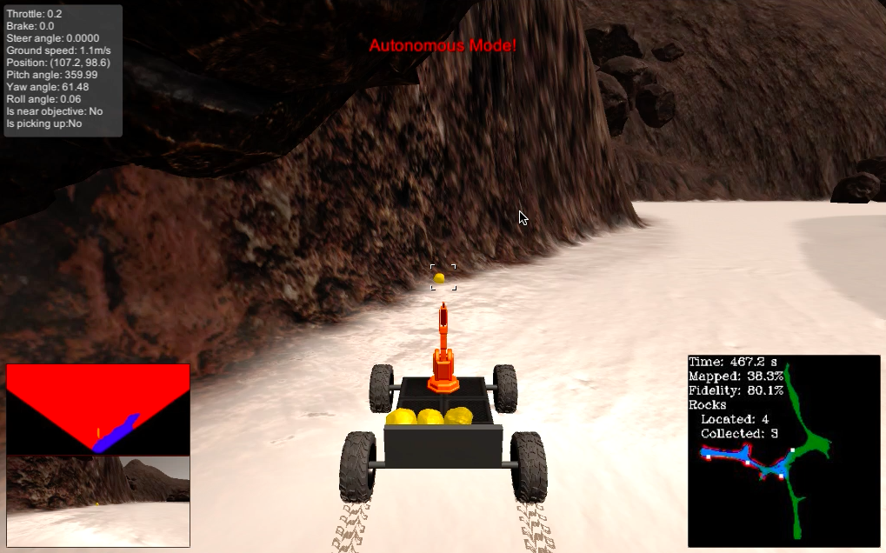
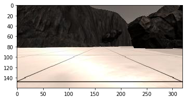
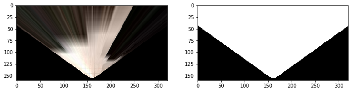
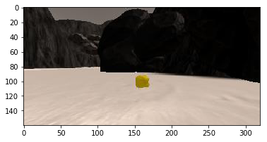
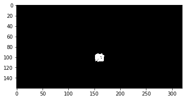
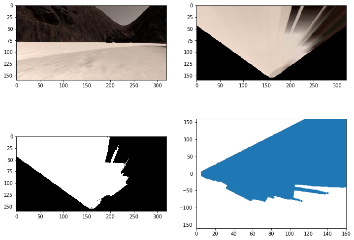
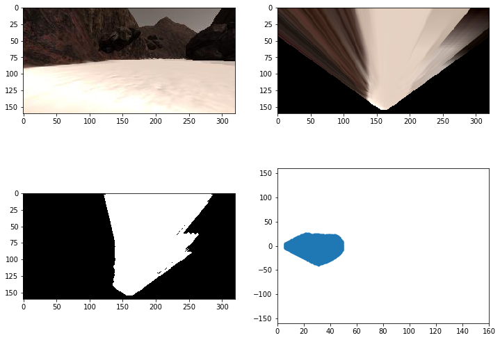

# Search and Sample Return
The aim of this project is to program an artifically intelligent rover to navigate its environment, collect interesting rocks, and bring them back to the starting location. This challenge is inspired by the [NASA Sample Return Challenge](https://www.nasa.gov/directorates/spacetech/centennial_challenges/sample_return_robot/index.html).



# Watch the Autonomous Rover Video 
Here is a [link](https://youtu.be/K-5Btd4xDUE) to watch the rover navigate its world autonomously and bring back all 6 rocks to its starting location.

# Overall Results 
The rover successfully picks up all 6 rocks and brings them back to the starting location. It maps 96.7% of the world at 80.4% fidelity, in 870 seconds. As seen in the video, it manages to extricate itself when it gets stuck, and even detects when it is moving in circles (and manages to get out of the circle). Usually the rover follows the left wall, until it has to go home. The settings used were 1024 x 768 resolution with 'Good' graphics quality, on Mac OS X 10.11.6 .

# Detailed Analysis

## Notebook (Rover_Project_Test_Notebook.ipynb)
### 1. Perspective Transform

The first step of the perception process involves converting an image to rover-centric coordinates, so that we can see what the world looks like from the rover's point of view. This is achieved by means of OpenCV's perspective transform.

The perspect_transform takes in four source and four destination points. In the pictures below, the source points are those that define the black square. The destination square is a 10-pixel square at the bottom center of the image.

The perspect_transform function also returns a mask that shows the pixels that are visible from the rover's camera. We will use this mask to later construct an obstacle map.


```python
import cv2 # OpenCV for perspective transform
import numpy as np

def perspect_transform(img, src, dst):
           
    M = cv2.getPerspectiveTransform(src, dst)
    warped = cv2.warpPerspective(img, M, (img.shape[1], img.shape[0]))# keep same size as input image
    mask = cv2.warpPerspective(np.ones_like(img[:,:,0]), M, (img.shape[1], img.shape[0]))
    
    return warped, mask
```



The image below on the right is the mask, and the image on the left results from applying the perspective transform to the image above.



### 2. Color Thresholding 

By applying two simple color thresholds for each color channel (RGB), we can detect both walls and interesting rocks. The following two functions perform color thresholding.

The color_thresh function cuts off from below, with the default RGB values of (160, 160, 160). This works well for identifying walls.

The color_squeeze function applies both an upper and a lower threshold. It turns out that an upper threshold of (255, 255, 50) and a lower threshold (120, 110, 0) work well to detect interesting rocks.


```python
def color_thresh(img, rgb_thresh=(160, 160, 160)):
    # Create an array of zeros same xy size as img, but single channel
    color_select = np.zeros_like(img[:,:,0])
    # Require that each pixel be above all three threshold values in RGB
    # above_thresh will now contain a boolean array with "True"
    # where threshold was met
    above_thresh = (img[:,:,0] > rgb_thresh[0]) \
                & (img[:,:,1] > rgb_thresh[1]) \
                & (img[:,:,2] > rgb_thresh[2])
    # Index the array of zeros with the boolean array and set to 1
    color_select[above_thresh] = 1
    # Return the binary image
    return color_select

# This is used to detect rocks
def color_squeeze(img, rgb_d, rgb_u):
    # Create an empty array the same size in x and y as the image                                                                                                               
    # but just a single channel                                                                                                                                                 
    color_select = np.zeros_like(img[:,:,0])
                                                                                                                                       
    idx = (img[:,:,0] >= rgb_d[0]) & (img[:,:,0] <= rgb_u[0]) & (img[:,:,1] >= rgb_d[1]) & (img[:,:,1] <= rgb_u[1]) & \
    (img[:,:,2] >= rgb_d[2]) & (img[:,:,2] <= rgb_u[2])
    color_select[idx] = 1
    return color_select

red_down = 120
green_down = 110
blue_down = 0
rgb_down = (red_down, green_down, blue_down)

red_up = 255
green_up = 255
blue_up = 50
rgb_up = (red_up, green_up, blue_up)
```

Below is the result of applying color_squeeze with the specified thresholds to a picture with an interesting rock. Clearly the rock pixels have been distinguished. 




### 3. Converting to Rover Coordinates


```python
def rover_coords(binary_img):
    # Identify nonzero pixels
    ypos, xpos = binary_img.nonzero()
    # Calculate pixel positions with reference to the rover position being at the 
    # center bottom of the image.  
    x_pixel = -(ypos - binary_img.shape[0]).astype(np.float)
    y_pixel = -(xpos - binary_img.shape[1]/2 ).astype(np.float)
    return x_pixel, y_pixel
```

Now we transform the image to rover-centric coordinates in order to see the world from the rover's point of view (Rover is at (0,0)). The above function simply performs a translation, rotation, and reflection to produce the following rover-centric coordinate system. Below is the full transformation of an unmodified image into rover-centric coordinates on the bottom-right. 

Notice in particular that the rover-centric systems is centered at 0, and that negative y-values correspond to a right turn.



### 4. Range Cutoff

It was found via experiment that limiting the range of the rover camera to 5 meters improves fidelity by about 10%. This may be because of greater inraccuracy in capturing far-off objects. The following function takes in x and y values in the rover-centric system and returns only those a specified distance ahead of the rover.
The default range is 5 meters (50 pixels).


```python
def range_limit(xpix, ypix, range=50):
    dist = np.sqrt(xpix**2 + ypix**2)
    return xpix[dist < range], ypix[dist < range]
```

Below is the result of performing a 5 meter range cutoff in rover-centric coordinates.


### 5. Converting to World Coordinates 

Finally we need to convert the rover-centric image into world-centric coordinates so that we can update the rover's world map. This is achieved by translating by the rover's current position (in world coordinates), and then rotating anticlockwise by the yaw angle. 


```python
# Define a function to map rover space pixels to world space
def rotate_pix(xpix, ypix, yaw):
    # Convert yaw to radians
    yaw_rad = yaw * np.pi / 180
    xpix_rotated = (xpix * np.cos(yaw_rad)) - (ypix * np.sin(yaw_rad))
                            
    ypix_rotated = (xpix * np.sin(yaw_rad)) + (ypix * np.cos(yaw_rad))
    # Return the result  
    return xpix_rotated, ypix_rotated

def translate_pix(xpix_rot, ypix_rot, xpos, ypos, scale): 
    # Apply a scaling and a translation
    xpix_translated = (xpix_rot / scale) + xpos
    ypix_translated = (ypix_rot / scale) + ypos
    # Return the result  
    return xpix_translated, ypix_translated


# Define a function to apply rotation and translation (and clipping)
# Once you define the two functions above this function should work
def pix_to_world(xpix, ypix, xpos, ypos, yaw, world_size, scale):
    # Apply rotation
    xpix_rot, ypix_rot = rotate_pix(xpix, ypix, yaw)
    # Apply translation
    xpix_tran, ypix_tran = translate_pix(xpix_rot, ypix_rot, xpos, ypos, scale)
    # Perform rotation, translation and clipping all at once
    x_pix_world = np.clip(np.int_(xpix_tran), 0, world_size - 1)
    y_pix_world = np.clip(np.int_(ypix_tran), 0, world_size - 1)
    # Return the result
    return x_pix_world, y_pix_world
```

### 6. process_image function 

The process_image function in Rover_Project_Test_Notebook.ipynb performs the above 5 steps exactly as explained above. After this, it updates the worldmap for rocks, obstacles, and navigable terrain. Obstacles correspond to the red channel and navigable terrain corresponds to the blue channel. 

For full details, see the notebook itself. At the end of the notebook, the process_image function is used to produce a video, which is available in this repository as test_mapping.mp4 .

## Autonomous Navigation: Perception 

The perception.py file contains the perception_step function, which constitutes the perception step of the rover. This function is similar to the process_image function described above, with only a few changes.

The first change is that we only update the Rover's worldmap when the Rover's pitch and roll angles are between 0 and 0.7 (or between 359.3 and 360). This is done because the perspective transform is technically only valid if the rover's pitch and roll are zero. 
The result of this restriction is an increase in fidelity by a few percentage points.

The second change is that we also have to update the Rover.vision_image data member. This is the current camera image after applying a perpective transform, and color thresholding suitably.  


```python
threshed = color_thresh(warped)
squeezed = color_squeeze(warped, rgb_down, rgb_up)

obs_map = np.absolute(np.float32(threshed)-1) * mask
                                                                                                                                      
Rover.vision_image[:,:,2] = threshed * 255
Rover.vision_image[:,:,0] = obs_map * 255

if squeezed.any():
    Rover.vision_image[:,:,1] = 255 * squeezed
else:
    Rover.vision_image[:,:,1] = 0
```

Here we can see the use of the mask variable from before. It is used to blacken out all the pixels that are outside the camera's field of vision.

The final change involves converting from rover-centric coordinates to polar coordinates, so that the Rover can be given an array of navigable angles.


```python
dist, angles = to_polar_coords(xpix, ypix)
Rover.nav_angles = angles
```

## Autonomous Navigation: Decision 

Once the RoverState class object has been suitably updated during the perception step, the next step is to take decisions and send these commands to the actual rover in the simulation.

The decision.py file contains the decision_step function, which is moderately complicated and contans quite a few modifications. A high-level overview will be provided below; please see the file itself for full details.

At any time, the Rover can be in one of several states. Each state wil be explained.

### 1. forward 

This state involves the rover driving forward while following the left wall. If the camera can see a certain nuber of navigable pixels ahead, then the Rover stays in forward mode. Otherwise, it goes into stop mode. This threshold is Rover.stop_forward, which can be found in drive_rover.py .

Left wall following is achieved by adding a steering bias to the mean of all navigable angles. Some rover modes change the steer bias temporarily. 


```python
Rover.steer = np.clip(np.mean(Rover.nav_angles) * 180/np.pi + Rover.steer_bias, -15, 15)
```

The forward mode is implemented by an auxiliary function called forward_aux, though forward_aux is not exclusively used by the forward mode. forward_aux checks for enough room on both sides of the rover, to avoid getting stuck in tricky places. This becomes particularly important when wall following is being done.

The forward_aux function considers a strip of pixels, 40 pixels wide, directly in front of the rover camera (40 pixels is about 4 meters). The aforementioned checks are then performed on this strip of pixels.


```python
mid_x = []
mid_y = []

for i in range(0, len(Rover.nav_x)):
    if Rover.nav_y[i] <= 20 and Rover.nav_y[i] >= -20:
        mid_x.append(Rover.nav_x[i])
        mid_y.append(Rover.nav_y[i])
mid_x = np.array(mid_x)
mid_y = np.array(mid_y)
```

forward_aux then performs various checks to ensure the Rover is not too close to an obstacle on its sides. If there are too few navigable pixels to either the left or right (where 'few' is defined by the threshold Rover.stop_side), the Rover turns hard to the other side.


```python
if len(mid_y[mid_y >= 0]) < Rover.stop_side:
        Rover.throttle = 0
        Rover.brake = 0
        Rover.steer = -15
        return Rover
elif len(mid_y[mid_y < 0]) < Rover.stop_side:
        Rover.throttle = 0
        Rover.brake = 0
        Rover.steer = 15
        return Rover
```

If there are more than Rover.stop_side pixels on both sides, then if there is significantly more room to one side, then the rover turns toward the spacious side more gradually. Here, 'significantly more room' is defined by the threshold Rover.left_right_ratio, as seen below.


```python
 elif len(mid_y[mid_y < 0]) >= Rover.left_right_ratio * len(mid_y[mid_y >= 0]):
        Rover.steer = np.clip(np.mean(Rover.nav_angles[Rover.nav_angles < 0]) * 180/np.pi, -15, 15)
```

It is only after these checks are done that forward_aux implements left wall following.

### 2. stuck 

The rover enters stuck mode if it has not moved 1 meter in 10 seconds, and rock pickup has not been sent for at least 20 seconds. The unstuck procedure is a 13-second manoeuvre, which keeps repeating until the rover moves 2 meters away from the place where it got stuck.

For the first 6 seconds, the rover moves backward aggressively. 


```python
 if np.floor(Rover.total_time - Rover.stuck_start_time) % 13 <= 5:
        Rover.throttle = -Rover.unstuck_throttle
        Rover.steer = 0
        Rover.brake = 0
```

Then the rover stops and turns in the direction with more navigable pixels.


```python
elif np.floor(Rover.total_time - Rover.stuck_start_time) % 13 <= 6:
        Rover.throttle = 0
        Rover.steer = 0
        Rover.brake = Rover.brake_set
# Turn to the direction with more navigable pixels                                                                                                                                            
elif np.floor(Rover.total_time - Rover.stuck_start_time) % 13 <= 7:
        Rover.throttle = 0
        if len(Rover.nav_y[Rover.nav_y >= 0]) > Rover.left_right_ratio * len(Rover.nav_y[Rover.nav_y < 0]):
            Rover.steer = 15
        else:
            Rover.steer = -15
            Rover.brake = 0
```

Finally, the rover tries to go forward (using forward_aux) but with no steering bias. So it will basically be following the mean navigable angle, throttling more aggressively.


```python
else:
        Rover.steer_bias = 0
        Rover.throttle_set = Rover.unstuck_throttle
        Rover.max_vel = 2
        Rover = forward_aux(Rover)
```

### 3. circle 

With left wall following, the rover will inevitably start going in circles at some point. The circle mode gets the rover out of this situation. A rover enters circle mode if its steering angle has been bigger than 8 or less than -8 for 10 seconds, and if there hasn't been a pickup, stop, or stuck for 20, 10, and 10 seconds respectively (circle mode is disabled when the rover is going home after picking up all rocks). 

The circle mode lasts 10 seconds, during which the rover follows the mean navigable angle.


```python
elif Rover.mode == 'circle':
        # Return to forward mode after ten seconds                                                                                                                                                    
        if Rover.total_time - Rover.circle_start_time >= 10:
            Rover.mode = 'forward'
            Rover.steer_bias = 10
        # For ten seconds, just follow the mean navigable angle                                                                                                                                       
        else:
            Rover.steer_bias = 0
            Rover = forward_aux(Rover)
```

### 4. get_rock 

get_rock mode is entered if the rover is not in stuck mode, and the camera can see at least Rover.rock_collect_threshold pixels belonging to a rock. 

The get_rock mode is straightforward. It tries to follow the angle of the closest rock pixel. This avoids confusion when the rover can see two rocks nearby. Since the rocks are rarely at the same distance, this ends up working. 


```python
 if len(Rover.rock_angles) > Rover.rock_collect_threshold:
        idx = np.argmin(Rover.rock_dist)
        Rover.steer = np.clip(Rover.rock_angles[idx] * 180/np.pi, -15, 15)
```

Once the rover is close enough to the rock, it just sends a pickup. 

### 5. stop

This mode has not been modified, except that the steer bias has been introduced. 

### 6. go home 

This is technically NOT a mode, but it might as well be. In practice, this is just implemented by forward_aux, which is called by the forward mode. 
To go home, the rover follows the bearing to its starting point as best possible. Some simple Euclidean geometry is sufficient to calculate the bearing to home. This is implemented by the following function.


```python
def get_bearing(x_r, y_r, x_h, y_h, yaw):
    dy = y_r - y_h
    dx = x_r - x_h
    if dx == 0:
        if y_r > y_h:
            theta = 90
        else:
            theta = 270
    else:
        theta = np.arctan2(dy, dx) * 180/np.pi

    bearing = 180 + theta - yaw

    # Corrections that lead to smoother path planning                                                                                                                                                     
    if bearing > 180:
        bearing = bearing - 360
    elif bearing < -180:
        bearing = 360 + bearing
    elif np.absolute(bearing) == 360:
        bearing = 0

    return bearing
```

As can be seen, the bearing to home is just 180 + theta - yaw . Once the bearing is known, the rover first takes navigable angles that lie between the 25th and 75th percentile. From these angles, it picks the one closest in absolute value to the bearing angle. This is the angle which the rover follows.


```python
lo = np.percentile(Rover.nav_angles, 25)
hi = np.percentile(Rover.nav_angles, 75)
deg_angles = Rover.nav_angles[Rover.nav_angles < hi]
deg_angles = deg_angles[deg_angles > lo] * 180/np.pi
arr = np.absolute(deg_angles - get_bearing(Rover.pos[0], Rover.pos[1], Rover.init_pos[0], Rover.init_pos[1], Rover.yaw))
idx = np.argmin(arr)
Rover.steer = np.clip(deg_angles[idx], -15, 15)
```

As can be seen in the video, this method successfully brings the rover back to its home position. 

# Improvements

1. Turning left after picking up a rock. This avoids retracing areas the rover has been to.
2. Give the rover the ability to avoid areas it has been to. 
3. HSV thresholding may help to better distinguish obstacles and interesting rocks. 
4. We can use monocular depth perception to determine how far objects are. To create parallax, we can have the rover stop, and move one side, and then to the other side, by a specified angle. However, I'm not sure how to determine which pixel got moved where in the two images. 
5. Using A* to compute an optimal path home after collecting all rocks. We can do path smoothing using gradient descent quite easily. 
